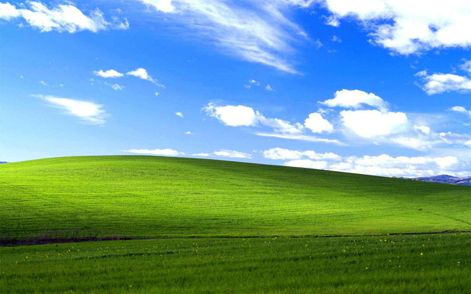
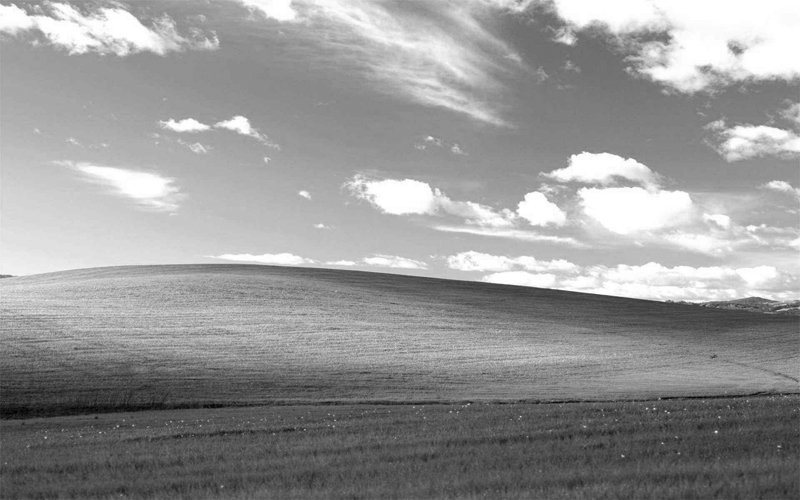
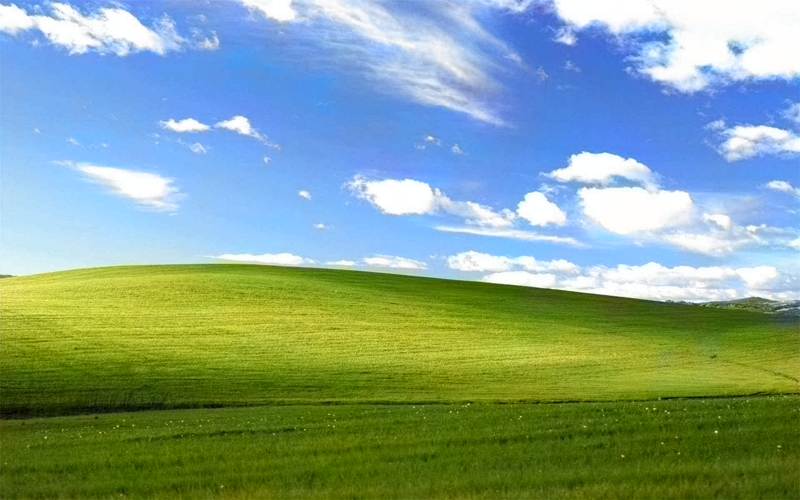

# 使用卷积神经网络给图片上色

### 概述

本项目使用了 [siggraph2016_colorization](http://hi.cs.waseda.ac.jp/~iizuka/projects/colorization/en/) 一个基于卷积神经网络的图片自动上色模型。我觉得这个想法很赞，就收集一些历史老照片来重新上色看看会是怎样的。图片来源于网络。具体使用方法参考 [官方文档](https://github.com/satoshiiizuka/siggraph2016_colorization)。


### 初体验

我想下面这张图片大家都应该跟熟悉，Windows 系统的经典壁纸。这是原图。
<div align="center">
    
</div>

去色后的效果。
<div align="center">
    
</div>

自动上色后的效果。
<div align="center">
    
</div>

效果可以说是非常棒了，基本上没有什么违和感！这个模型用于风景的效果要稍微强于人物。


### 画展

请移步至 [chenjiandongx/make-it-colorful](http://chenjiandongx.com/make-it-colorful)


### Citing

```
 @Article{IizukaSIGGRAPH2016,
   author = {Satoshi Iizuka and Edgar Simo-Serra and Hiroshi Ishikawa},
   title = {{
       Let there be Color!: Joint End-to-end Learning of Global and Local 
       Image Priors for Automatic Image Colorization with Simultaneous Classification
       }},
   journal = "ACM Transactions on Graphics (Proc. of SIGGRAPH 2016)",
   year = 2016,
   volume = 35,
   number = 4,
 }
 ```


### License

MIT [©chenjiandongx](https://github.com/chenjiandongx)
